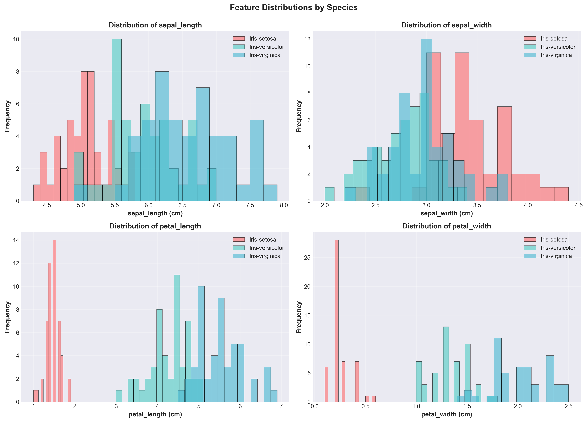
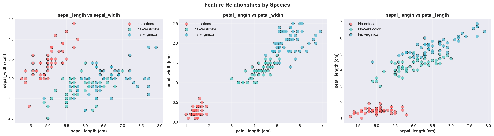
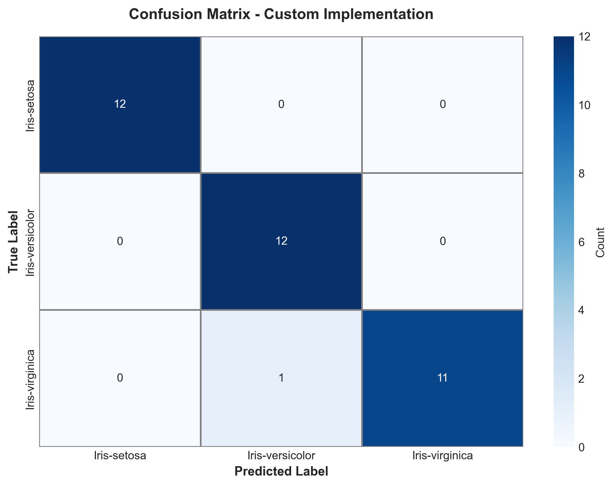
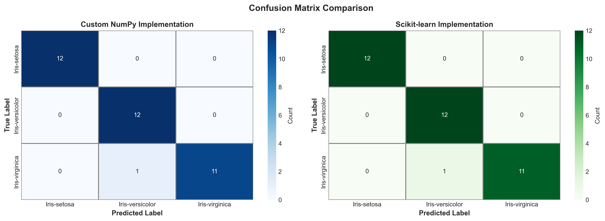
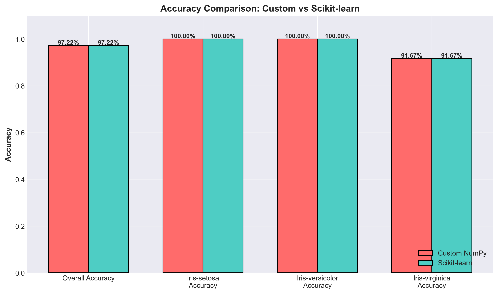
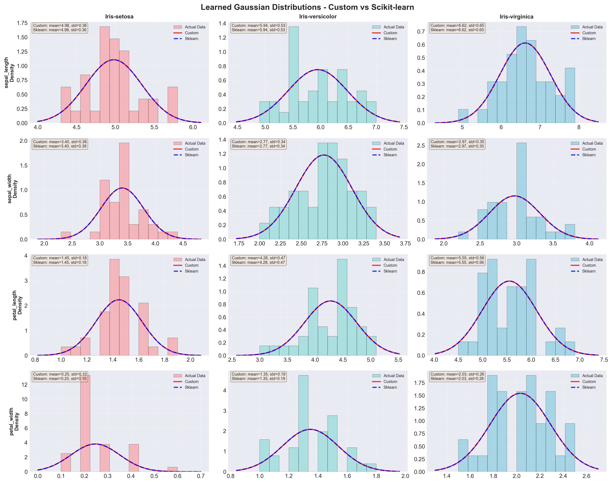

# Naive Bayes IRIS Classification Project

A comprehensive educational project comparing custom NumPy and scikit-learn implementations of Gaussian Naive Bayes classifier on the IRIS dataset.

## Project Overview

This project demonstrates the mathematical foundations of Naive Bayes classification by:
1. Implementing Gaussian Naive Bayes from scratch using NumPy
2. Implementing the same algorithm using scikit-learn
3. Comparing both implementations in detail
4. Generating comprehensive visualizations and analysis

## Results Summary

- **Custom Implementation Accuracy**: 97.22%
- **Scikit-learn Accuracy**: 97.22%
- **Prediction Agreement**: 100% (all predictions match)
- **Training Samples**: 114
- **Test Samples**: 36
- **Classes**: 3 (Iris Setosa, Versicolor, Virginica)
- **Features**: 4 (sepal length/width, petal length/width)

## Project Structure

```
ai-course-exercise/
├── data/                    # Data handling package
│   ├── loader.py           # Load CSV and split train/test (56 lines)
│   ├── encoder.py          # Encode species labels (55 lines)
│   ├── preprocessor.py     # Data preparation pipeline (64 lines)
│   └── __init__.py         # Package exports
│
├── models/                  # Model implementations
│   ├── custom/             # Custom Naive Bayes
│   │   ├── probability.py  # Gaussian PDF calculations (73 lines)
│   │   ├── trainer.py      # Training utilities (55 lines)
│   │   ├── classifier.py   # Main classifier class (89 lines)
│   │   └── __init__.py     # Package exports
│   ├── sklearn_wrapper.py  # Scikit-learn wrapper (115 lines)
│   └── __init__.py         # Package exports
│
├── visualizations/          # Visualization package
│   ├── config.py           # Styling configuration (38 lines)
│   ├── features.py         # Feature plots (76 lines)
│   ├── confusion.py        # Confusion matrices (62 lines)
│   ├── comparisons.py      # Comparison charts (51 lines)
│   ├── distributions.py    # Distribution plots (69 lines)
│   └── __init__.py         # Package exports
│
├── evaluation/              # Evaluation package
│   ├── metrics.py          # Metrics calculation (50 lines)
│   ├── comparator.py       # Model comparison (95 lines)
│   ├── reporter.py         # Report generation (92 lines)
│   └── __init__.py         # Package exports
│
├── pipeline/                # Execution pipeline
│   ├── executor.py         # Model training (74 lines)
│   ├── visualizer.py       # Visualization pipeline (49 lines)
│   ├── reporter.py         # Report generation (86 lines)
│   └── __init__.py         # Package exports
│
├── main.py                  # Main execution script (96 lines)
├── requirements.txt         # Python dependencies
├── README.md                # This file
├── ANALYSIS_REPORT.md       # Comprehensive analysis
├── plots/                   # Generated visualizations
└── outputs/                 # Text reports

Total: ~1,400 lines across 24 Python files
All files < 150 lines for maintainability
```

## Installation

### Prerequisites
- Python 3.7 or higher
- pip package manager

### Install Dependencies

```bash
pip install -r requirements.txt
```

Required packages:
- numpy >= 1.21.0
- pandas >= 1.3.0
- matplotlib >= 3.4.0
- seaborn >= 0.11.0
- scikit-learn >= 1.0.0

## Usage

### Run the Complete Pipeline

```bash
python main.py
```

This will:
1. Load and prepare the IRIS dataset
2. Generate exploratory visualizations
3. Train both Naive Bayes implementations
4. Compare results and generate reports
5. Save all visualizations and summaries

## Code Architecture

### Modular Design

The codebase is organized into focused packages:

**Data Package** (`data/`):
- `loader.py`: CSV loading and train/test splitting
- `encoder.py`: Species label encoding
- `preprocessor.py`: Complete data preparation pipeline

**Models Package** (`models/`):
- `custom/probability.py`: Gaussian probability calculations
- `custom/trainer.py`: Training parameter calculation
- `custom/classifier.py`: Main Naive Bayes classifier
- `sklearn_wrapper.py`: Scikit-learn GaussianNB wrapper

**Visualizations Package** (`visualizations/`):
- `config.py`: Centralized styling and configuration
- `features.py`: Feature distribution and relationship plots
- `confusion.py`: Confusion matrix visualizations
- `comparisons.py`: Accuracy comparison charts
- `distributions.py`: Learned Gaussian distribution plots

**Evaluation Package** (`evaluation/`):
- `metrics.py`: Calculate accuracy, precision, recall, F1
- `comparator.py`: Compare predictions and parameters
- `reporter.py`: Generate comparison summaries

**Pipeline Package** (`pipeline/`):
- `executor.py`: Orchestrate model training and evaluation
- `visualizer.py`: Visualization generation pipeline
- `reporter.py`: Report generation pipeline

### Key Design Principles

1. **Modularity**: Each file has a single, clear responsibility
2. **Maintainability**: All files under 150 lines
3. **Reusability**: Package-based organization
4. **Separation of Concerns**: Clear boundaries between components
5. **Extensibility**: Easy to add new features or models

## Implementation Features

### Custom NumPy Implementation

The custom implementation is split across multiple focused modules:

**Probability Calculations** (`models/custom/probability.py`):
```python
def calculate_gaussian_probability(x, mean, std):
    """Calculate Gaussian PDF: P(x) = (1/√(2πσ²)) × exp(-(x-μ)²/(2σ²))"""

def calculate_log_likelihood(X, means, stds, class_idx):
    """Calculate log-likelihood to prevent numerical underflow"""
```

**Training** (`models/custom/trainer.py`):
```python
def calculate_class_parameters(X, y, epsilon=1e-9):
    """Calculate priors, means, and standard deviations"""
```

**Classifier** (`models/custom/classifier.py`):
```python
class NaiveBayesCustom:
    def fit(X_train, y_train):     # Train the model
    def predict(X_test):            # Make predictions
    def predict_proba(X_test):      # Get probabilities
    def score(X_test, y_test):      # Calculate accuracy
```

### Scikit-learn Implementation

**Wrapper** (`models/sklearn_wrapper.py`):
```python
class NaiveBayesSklearn:
    """Wrapper providing consistent API with custom implementation"""
    # Same interface as NaiveBayesCustom for easy comparison
```

## Comprehensive Visualizations

All visualizations are generated with:
- High resolution (300 DPI)
- Professional styling
- Clear English labels
- Consistent color schemes

### 1. Feature Distributions

Histograms showing the distribution of each feature across the three Iris species:



### 2. Feature Relationships

Scatter plots revealing relationships between feature pairs:



### 3. Confusion Matrices

**Custom NumPy Implementation:**



**Scikit-learn Implementation:**


### 4. Confusion Matrix Comparison

Side-by-side comparison of both implementations:



### 5. Accuracy Comparison

Bar chart comparing accuracy metrics between implementations:



### 6. Learned Gaussian Distributions

4×3 grid showing the Gaussian distributions learned by both models for each feature and class:



## Understanding the Output

### Console Output

The pipeline provides:
- Data loading statistics
- Training progress for each class
- Learned parameters (means, standard deviations, priors)
- Performance metrics for both implementations
- Detailed comparison analysis

### Generated Files

**Plots** (`plots/` directory):
- 7 high-resolution PNG images
- Professional styling with clear labels

**Reports** (`outputs/` directory):
- `comparison_summary.txt`: Detailed metrics and findings

## Educational Value

### Mathematical Concepts
- Bayes' theorem and probabilistic reasoning
- Gaussian (normal) distribution
- Conditional probability and independence
- Maximum likelihood estimation
- Log-space calculations for numerical stability

### Implementation Skills
- NumPy vectorization and broadcasting
- Modular package design
- Code organization and separation of concerns
- Handling numerical precision
- Testing and validation

### Machine Learning Practices
- Train/test splitting
- Model evaluation metrics
- Confusion matrix analysis
- Comparing implementations
- Visualization techniques

## Algorithm Overview

### Gaussian Naive Bayes

**Training Phase**:
```
1. Calculate prior probabilities:
   P(class) = count(class) / total_samples

2. For each feature and class, calculate:
   mean (μ) = Σx / n
   std (σ) = √(Σ(x - μ)² / n)
```

**Prediction Phase**:
```
1. For each class, calculate likelihood:
   P(x|class) = (1 / √(2πσ²)) × exp(-(x - μ)² / (2σ²))

2. Calculate posterior probability (log-space):
   log P(class|features) = log P(class) + Σ log P(feature_i|class)

3. Predict class with highest probability
```

## Performance Metrics

### Overall Results
- Both implementations: **97.22% accuracy**
- Parameter differences: < 10⁻⁸ (virtually identical)
- Prediction agreement: 100%

### Per-Class Results

| Class | Samples | Accuracy | Precision | Recall | F1-Score |
|-------|---------|----------|-----------|--------|----------|
| Setosa | 12 | 100% | 100% | 100% | 100% |
| Versicolor | 12 | 100% | 92% | 100% | 96% |
| Virginica | 12 | 92% | 100% | 92% | 96% |

### Confusion Matrix
```
Predicted →      Setosa  Versicolor  Virginica
True ↓
Setosa              12          0          0
Versicolor           0         12          0
Virginica            0          1         11
```

## Comparison: Custom vs Scikit-learn

### Custom Implementation
**Pros**:
- Full understanding of algorithm
- Educational value
- Easy to modify and customize
- Modular, reusable components
- No "black box" behavior

**Cons**:
- More total lines of code
- Requires understanding of math
- Manual edge case handling

### Scikit-learn Implementation
**Pros**:
- Production-ready
- Highly optimized
- Extensively tested
- Well-documented

**Cons**:
- Less transparent
- Harder to customize
- Additional dependency

## Extensions and Future Work

Possible enhancements:
1. Cross-validation module
2. ROC curves and AUC metrics
3. Feature importance analysis
4. Hyperparameter tuning
5. Other Naive Bayes variants
6. Comparison with other classifiers
7. Interactive visualizations
8. Unit tests for each module

## Contributing

This is an educational project. Suggestions for improvements:
- Additional visualizations
- More detailed documentation
- Performance optimizations
- Additional test cases
- Unit tests

## License

This project is created for educational purposes as part of an AI development course.

## Acknowledgments

- **IRIS Dataset**: R.A. Fisher (1936)
- **Scikit-learn**: Pedregosa et al. (2011)
- **NumPy & Pandas**: The scientific Python community

---

## Quick Start Guide

1. **Install dependencies**: `pip install -r requirements.txt`
2. **Ensure IRIS.csv** is in the parent directory
3. **Run the pipeline**: `python main.py`
4. **View results**: Check `plots/` and `outputs/` directories
5. **Read analysis**: Open `ANALYSIS_REPORT.md`

## Learning Path

Recommended order for studying this project:

1. **Understand structure**: Review the package organization
2. **Read** `ANALYSIS_REPORT.md` for theory and context
3. **Examine** `data/` package to understand preprocessing
4. **Study** `models/custom/` to see the mathematics
5. **Compare** with `models/sklearn_wrapper.py`
6. **Explore** `visualizations/` for plotting techniques
7. **Review** `evaluation/` for comparison methods
8. **Understand** `pipeline/` for orchestration
9. **Run** `main.py` to see everything in action

---

**Architecture**: Modular, package-based design with all files < 150 lines
**Total Code**: ~1,400 lines across 24 Python files
**Focus**: Educational clarity and maintainability
